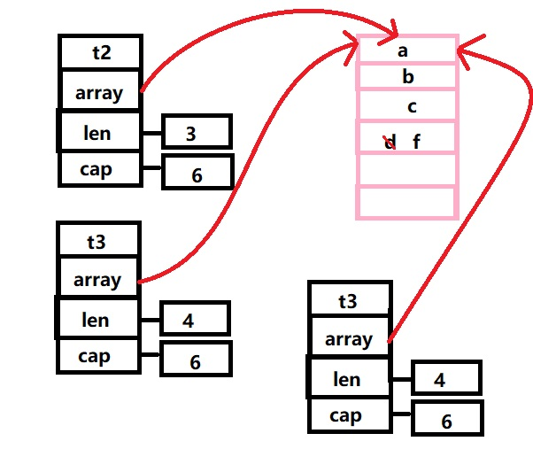

# Golang中的slice陷阱

## slice 的基础

slice是一种动态数组，大部分的语言都有类似的结构。他比数组更灵活，可以自动的进行扩容。可以直接看到它的源码：

```go
type slice struct {
    array unsafe.Pointer 
    len   int  
    cap   int
}
```

内部存在`len`和`cap`来完成自动扩容，如果`len`要超过`cap`了，就进行扩容。当`slice`小于1024的时候，`slice`的容量会扩充为原来的2倍，超过1024则扩容为原来的1.25倍。扩容会进行内容对齐，所以并非严格意义上的2倍或1.25倍。

## slice data race

```go
func main(){
    s := []int{5}
    s = append(s, 7)
    s = append(s, 9)
    x := append(s, 11)
    y := append(s, 12)
   fmt.Println(s, x, y)
   //[5 7 9] [5 7 9 12] [5 7 9 12]
}
```




学过C++和Java的人应该能理解，这是浅拷贝或指针复用相关的问题。由于`s`的`len`并未修改所以，第二次在添加数据的时候依旧是添加的`9`后面。


例如这样的问题，一单放到不同函数之中，则会更隐蔽的等待触发错误且更难以发现。

```go
func test1(h string, hl []string) []string {
  return append(hl, h)
}

func main() {
  t1 := []string{"a", "b", "c",}
  t2 := test1("d", t1)
  t3 := test1("e", t2)
  t4 = test1("f", t2)
  fmt.Printf(t1)//abc
  fmt.Printf(t2)//abcd
  fmt.Printf(t3)//abcf
  fmt.Printf(t4)//abcf
}
```


这与正常思维认为`t3`的答案并非`abce`。`test1`非常隐蔽的触发了这个问题，当t2不需要扩容的的时候，append表面上创建了一个新的slice但是内部的数组指针确实共用着t2的数组指针，当t4在进来的时候，依旧重复了这个动作就导致了我们上面的窘境，在Java中常说的浅拷贝就是类似的一种情况。

解决这样的问题本质是解决浅拷贝的问题，一个简单方法是完成深拷贝。直接去创建一个新的内部数组而禁止使用t2的内在数组。

```go
func test1(h string, hl []string) []string {
  t := append([]string{}, hl...)
  return append(t, h)
}
```

如果没有注意到slice是非线程安全的，那么就还有可能犯下隐式的错误。

```go
var s []int

func appendValue(i int) {
    s = append(s, i)
}

func main() {
    for i := 0; i < 10000; i++ { //10000个协程同时添加切片
        go appendValue(i)
    }

    for i, v := range s {
        fmt.Println(i, ":", v)
    }
    //输出数据必然小于10000吗，部分数据被丢失了
}
```

在这段代码中，由于相互竞争的s，最后被偷偷的丢掉了几个数据而不自知，且编译器不会提供任何警告
